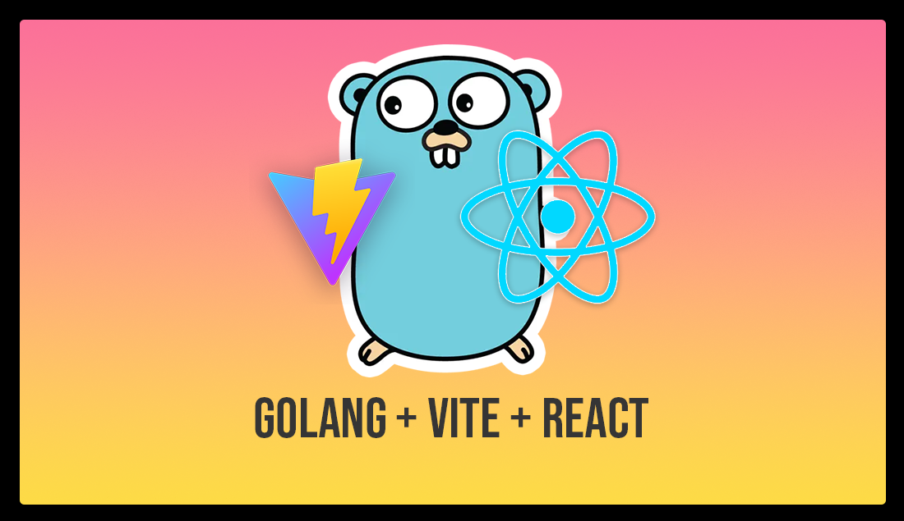

# Go - GAMA Application




Welcome to the GoLang Go-AMA (Ask Me Anything) application! This project is built using GoLang (React and Vite on the frontend).

## Table of Contents

- [Introduction](#introduction)
- [Features](#features)
- [Installation](#installation)
- [Usage](#usage)
- [License](#license)

## Introduction

The Go GAMA application allows users to create and participate in "Ask Me Anything" sessions. Users can post questions, and the host can answer them in real-time. This application is perfect for live Q&A sessions, webinars, and interactive discussions.

## Features

- **Real-time Q&A:** Users can post questions, upvote the ones they want to know the answer, and get answers in real-time.
- **Responsive Design:** Works seamlessly on both desktop and mobile devices.

## Installation

To get started with the Go AMA application, follow these steps:

1. **Clone the repository:**

   ```bash
   git clone https://github.com/CaioDGallo/go-ama.git
   cd go-ama
   ```

2. **Build Docker database dependency:**

   ```bash
   docker compose up
   ```

3. **Start the development server:**

   ```bash
   go run cmd/gama/main.go
   ```

4. **The API will be running on:**

   ```
   http://localhost:8080
   ```

## Usage

Once the application is up and running, you can start creating and participating in AMA sessions. Here is the Postman collection containing all the requests:

[](docs/GAMA.postman_collection.json)

## License

This project is licensed under the MIT License. See the [LICENSE](LICENSE) file for more details.

---

Thank you for checking out the GAMA application! If you have any questions or need further assistance, feel free to reach out.
